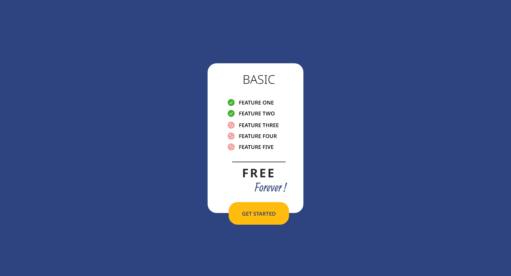

<h1 align="center"> ✨ Second FIGMA Exercise ✨ </h1>

### 🌐 Demo / Preview


---

### ✏️ **Description**
This is the second project I created by perfectly replicating a Figma design with pixel-perfect precision. The purpose of this project is not to be responsive but to practice and master the fundamental tools of HTML and CSS.

### 💻 **Technologies Used**
- **HTML5**: For structuring the content of the page.
- **CSS3**: For styling and visual appearance.

### **Key Features** 🚀
🎯 Pixel-perfect design: Recreated exactly as per the Figma mockup.

🎨 Clean and structured code: Focused on simplicity and clarity.

📚 Learning HTML & CSS fundamentals: Great for beginners to understand basic concepts

### 🛠️ **Installation & Usage**
1. Clone the repository:
   ```bash
   git clone https://github.com/HUYBERIC/figmaProjectV2.git
   cd figmaProjectV2

---

<h1 align="center"> ✨ Deuxième exercice FIGMA ✨ </h1>

---

### ✏️**Description**
Ceci est le deuxième projet que j'ai réalisé en reproduisant un design Figma en pixel perfect. Le but de ce fichier n'est pas d'être responsive, mais d'apprendre à utiliser les outils de base du HTML et du CSS.

### 💻 **Technologies utilisées**
- **HTML5**: Pour structurer le contenu de la page.
- **CSS3**: Pour le style et l'apparence visuelle.

### **Caractéristiques principales** 🚀
🎯 Design pixel-perfect : Reproduit exactement selon la maquette Figma.

🎨 Code propre et structuré : Axé sur la simplicité et la clarté.

📚 Apprentissage des bases HTML & CSS : Idéal pour débutants souhaitant comprendre les concepts fondamentaux.

### 🛠️ **Installation & Utilisation**
1. Cloner le dépôt:
   ```bash
   git clone https://github.com/HUYBERIC/figmaProjectV2.git
   cd figmaProjectV2